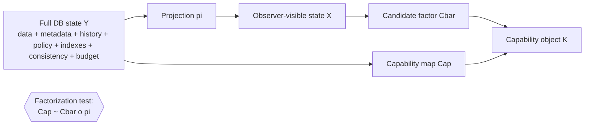
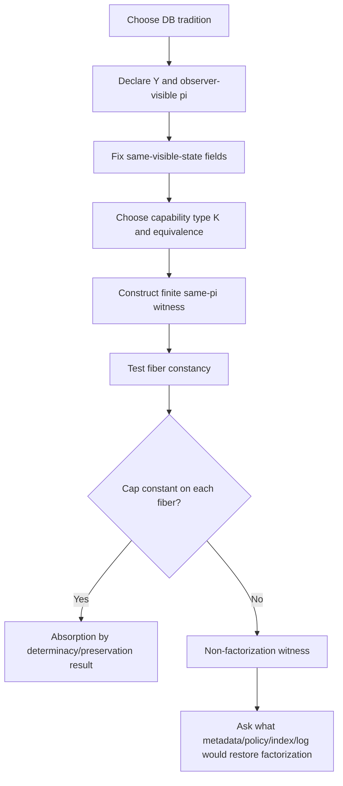

# Database Absorption Test for Capability Projection

## Executive summary

This memo treats your North Star as a **schema to stress-test**, not as a claim to defend. It follows the task framing, object language, and deliverables you supplied in your working materials. fileciteturn0file2 fileciteturn0file3 fileciteturn0file4

At a high level, **database theory and systems absorb a large fraction of the North Star once “state” is defined the way databases already define it**: not just visible tuples or documents, but also view definitions, constraints, transaction snapshot/isolation, lineage/provenance, access policy, index/materialization state, replication/consistency metadata, and approximation parameters. In that enriched sense, many database subfields already study exactly when a projection determines downstream answers, rewritings, reconstructions, explanations, or reachable operations. View determinacy, monotone determinacy, certain answers under incomplete information, provenance semirings, snapshot semantics, row-level security, materialized views, and distributed consistency are all mature versions of “does capability factor through the visible interface?” citeturn13academia0turn13academia2turn36academia1turn40academia1turn38academia1turn41view0turn25view3turn25view1turn42academia0turn14academia1

The hostile test result is therefore **not** “databases obviously refute the schema,” but rather: **payload-only versions of the schema are already familiar in databases, while novelty shrinks sharply when observer-visible state is allowed to include the operational metadata that database people usually count as part of the state.** Put differently, if `X` is only “what a user can see in the current rows,” non-factorization is routine; if `X` is “the full DB-visible state under a fixed observation regime,” factorization often becomes a determinacy or rewriting question that existing theory already handles. citeturn13academia0turn40academia1turn25view3turn41view0turn25view1

The strongest **residue** after database absorption is in settings where future capability depends on operational structure that is often *not* user-visible and is only partly capturable as exact state: approximate nearest-neighbor retrieval, latency/recall tradeoffs, workload-sensitive indexing, probabilistic freshness in distributed stores, and policy-sensitive access surfaces. There, equal visible data can still support different future operation sets unless one fixes index family and parameters, approximation tolerance, workload, resource budget, and consistency guarantees. That is where your schema survives most cleanly in database terms. citeturn28view0turn28view2turn28view3turn26view0turn28view4turn42academia0turn14academia1

The safest database-facing wording is therefore:

> For a fixed observer, task, horizon, and resource boundary, future database capability often fails to factor through **payload-visible state alone**. Whether it factors through an observer-visible projection depends on what the projection preserves: schema and constraints, view definitions, transaction snapshot/isolation, lineage/provenance, access policy, materialization/index state, consistency model, approximation parameters, workload, and budget.

That wording is strong, constructive, and much harder for database people to dismiss as naïve, because it acknowledges that the real contest is over **what counts as state** and **what equivalence on capability is admissible**. citeturn13academia0turn40academia1turn38academia1turn41view0turn25view3turn25view1turn28view0turn42academia0

## Formal translation into database terms

A rigorous database translation of your schema is:

- `Y`: a full database state under a chosen tradition. Minimally: base instance. Often also: schema, integrity constraints, null/incomplete-info semantics, view definitions, transaction snapshot and isolation level, lineage/provenance annotations, security policy, indexes/materializations, replication metadata, approximation knobs, and budgeted execution regime. citeturn13academia0turn40academia1turn38academia1turn41view0turn25view3turn25view1turn28view0turn42academia0
- `pi: Y -> X`: the observer-visible projection. Examples: a view instance, a role-filtered result surface, a materialized summary, a snapshot seen by one transaction, a document projection, a graph neighborhood, or a vector index query interface. citeturn13academia0turn25view3turn25view1turn26view5turn28view0
- `Cap: Y -> K`: a database capability object. Examples: one query answer, the family of answerable queries, a preorder of executable operations, a provenance object, a set of reconstructible histories, or an approximate retrieval envelope trading recall against latency. citeturn36academia1turn38academia1turn39academia0turn41view0turn28view0turn28view2
- `K`: the codomain for capability. In database practice, the most useful default is **an indexed preorder**, optionally enriched with provenance or approximation structure. A plain set is too weak for dominance and simulation claims; a full category is usually too committal for systems cases; provenance semirings are ideal when explanation or dependency-tracking is the capability; approximate retrieval needs an explicit error/latency envelope rather than exact equality. citeturn38academia1turn38academia2turn39academia0turn28view0turn42academia0

The right absorption question is therefore:

\[
\exists \bar{C}: X \to K/\!\sim \quad \text{s.t.} \quad Cap \sim \bar{C}\circ \pi
\]

where `~` is a declared equivalence on capability: exact equality for deterministic query answers, order-equivalence for action preorders, isomorphism for provenance objects, or an approximate envelope for ANN retrieval and latency-sensitive systems. This is exactly how database theory distinguishes exact determinacy, monotone determinacy, certain-answer semantics, provenance-preserving rewritings, and approximate operational guarantees. citeturn13academia0turn36academia1turn40academia1turn38academia1turn42academia0

Two results should be explicit in the memo.

**Fiber-Constancy Lemma.** `Cap` factors through `pi` up to equivalence `~` iff `Cap` is `~`-constant on every fiber of `pi`.  
*Proof sketch.* If `Cap ~ \bar C \circ pi`, then any `y1,y2` with `pi(y1)=pi(y2)` satisfy `Cap(y1) ~ Cap(y2)`. Conversely, if `Cap` is `~`-constant on fibers, define `\bar C(x)` by choosing any `y` with `pi(y)=x`; fiber-constancy makes the choice well-defined up to `~`. This is the right abstract shell around view determinacy and capability nondetermination.

**Same-visible-state discipline.** If you want a serious database test, hold fixed at least: schema, constraints, null/incomplete-data semantics, view definitions, security/access policy, transaction boundaries and isolation, snapshot timestamp or log position, provenance/lineage regime, materialization and refresh policy, index family and parameters, consistency model, approximation tolerance, workload, and resource budget. If these are not fixed, “same visible state” is underspecified in database terms. citeturn41view0turn25view3turn25view1turn29view0turn29view2turn28view0turn42academia0

A safe recommendation on `Cap` typing is:

- use a **set** only for single exact answer tasks,
- use a **preorder** as the default for “can do at least as much under the same budget,”
- use a **provenance semiring or witness object** when explanation is part of capability,
- use an **approximate envelope** for ANN and latency-sensitive systems,
- mention **category/enriched-category** language only as optional future work, not as the default framing. citeturn38academia1turn39academia0turn28view0turn42academia0

## Prior art map across database traditions

The table below gives the hostile absorption map. “Verdict” means: does the tradition substantially absorb the North Star, assuming exact DB terminology and the same-visible-state discipline above.

| Tradition | Canonical anchors | Formal mapping | Finite witness | Preservation control | Verdict | Suggested safe wording |
|---|---|---|---|---|---|---|
| Relational view determinacy | Determinacy and rewritability of queries from views; monotone determinacy; CQ determinacy undecidability. citeturn13academia0turn13academia2turn36academia1 | `Y` = base instance `D`; `pi` = view image `V(D)`; `Cap` = answer to target query `Q(D)` or family of answerable queries | Two base instances with same view image but different `Q` answer | Determinacy, monotone determinacy, UCQ/Datalog rewritability | **Strong absorption** | “In the relational setting, your question is a determinacy question: does the capability of answering `Q` factor through the visible view image?” |
| Dependencies and normalization | Lossless-join, 4NF/5NF, join dependencies, schema decomposition. citeturn23search0turn23search1turn23search5turn23academia2 | `pi` = decomposition into projections; `Cap` = exact reconstruction or join-based query capability | Same projections that either do or do not rejoin losslessly under dependencies | Functional, multivalued, and join dependencies | **Strong absorption** | “Payload equivalence is fragile unless decomposition is lossless under the declared dependencies.” |
| Data exchange and incomplete information | Certain answers; data exchange semantics; cores and possible worlds. citeturn40search0turn40academia1turn40search6turn40search7 | `Y` = possible world / source target solution; `pi` = incomplete visible instance; `Cap` = certain answers or best answers | Same incomplete visible state, different possible worlds, different non-certain answers | Certain-answer semantics, constraints, chase/core machinery | **Strong absorption** | “When state is incomplete, the right factorization target is usually certain-answer capability, not exact future state.” |
| Provenance and lineage | Provenance semirings; why-provenance; limits with difference; fine-grained SQL provenance. citeturn38academia1turn38academia2turn39academia0turn39academia2 | `pi` = output-only projection or output plus provenance; `Cap` = explanation / dependency object | Same output tuple, different witness sets or provenance polynomials | Semiring annotations, witness semantics | **Strong absorption** | “Output equality does not determine explanatory capability; provenance adds the missing state.” |
| Temporal DB and MVCC | Temporal data management and SQL temporal support; snapshot/isolation semantics in PostgreSQL. citeturn37search0turn37search4turn41view0 | `Y` = history + transaction-time metadata; `pi` = current snapshot seen by one observer | Same current rows, different histories or snapshots | Valid-time/transaction-time semantics, snapshot isolation, serializability | **Strong absorption** | “Future read/write capability depends on snapshot and temporal regime, not just current tuples.” |
| Event sourcing and append-only logs | Event sourcing pattern; replay/rebuild from event log. citeturn32view0 | `Y` = append-only log plus projections; `pi` = current materialized state | Same current table, different event logs, different replay/audit capability | Retaining the log, snapshots, reversal/replay rules | **Partial absorption** | “If the visible state omits the log, replay and audit capability need not factor through the current projection.” |
| Access control | RBAC/ABAC background; PostgreSQL row-level security. citeturn17academia0turn18search4turn25view3 | `Y` = data plus policy state; `pi` = observer-specific visible rows | Same base data, different policies, different answerable-action surface | Role, attribute, and row-security policy | **Strong absorption** | “Capability is observer-indexed by policy; equal payload does not imply equal visible operation sets.” |
| Indexes and materialized views | PostgreSQL indexes and materialized views. citeturn29view0turn25view1 | `Y` = base data plus physical design and freshness state; `pi` = visible relation or summary | Same relation contents, different index/materialization state, different latency/freshness capability | Index selection, refresh policy, planner statistics | **Partial absorption** | “Exact answer capability may factor, but latency- and freshness-bounded capability usually does not without physical-design metadata.” |
| OLAP and cubes | Data Cube operator; Timescale continuous aggregates. citeturn3academia2turn25view4 | `pi` = aggregate cube / continuous aggregate; `Cap` = supported analytics under declared grains | Same cube, hidden raw detail differences; or same raw data with different preaggregation surfaces | Additivity, grain, refresh/update policy | **Strong for declared-grain analytics; partial otherwise** | “Cubes preserve capability only for the measures and grains they materialize.” |
| Document databases | MongoDB schema validation and document indexing; PostgreSQL JSON indexing as a relational analog. citeturn27view0turn27view1turn29view2 | `Y` = document set plus validation/index config; `pi` = visible document projection | Same top-level documents, different validation or path-index regime | JSON schema validation, path/GIN indexes | **Partial absorption** | “For document stores, capability depends on whether schema and path-index metadata are counted as state.” |
| Graph databases and RDF | SPARQL 1.1, RDF semantics, SHACL, graph query foundations. citeturn26view5turn26view6turn29view1turn22academia0turn22academia1 | `Y` = graph plus entailment regime / shapes; `pi` = visible graph or neighborhood | Same edge set under different entailment or shape constraints, different query consequences | Entailment regime, path semantics, shape constraints | **Strong absorption** | “Graph capability is semantics-sensitive: visible triples alone need not determine reachable answers.” |
| Time-series stores | Continuous aggregates, retention/chunk semantics, Influx aggregate and retention behavior. citeturn25view4turn25view5turn27view4turn27view5turn29view3 | `Y` = raw series plus retention/compression/downsampling state; `pi` = current series window or rollup | Same current visible window, different retained history, different retrospective capability | Bucket retention, chunk deletion, compression, rollup policy | **Partial absorption** | “Current readings do not determine historical-query capability unless retention and rollup policy are fixed.” |
| Distributed stores and CRDTs | CRDT foundations and overview; bounded staleness in partial quorums. citeturn14academia1turn14academia3turn42academia0 | `Y` = replica states plus clocks/version metadata; `pi` = one replica’s visible payload | Same visible key-values, different divergence/staleness/merge rights | SEC, merge semilattice, quorum config, staleness envelope | **Strong for metadata-aware state; partial for payload-only state** | “Replica payload equality does not determine freshness or safe-write capability without consistency metadata.” |
| Vector databases and ANN retrieval | HNSW; Faiss; pgvector; MongoDB vector search. citeturn5academia0turn28view2turn28view3turn28view0turn26view0turn28view4 | `Y` = vectors plus metric, index, search params, filters, budget; `pi` = visible vectors or vector-search surface | Same vectors, different HNSW/IVFFlat/ENN-ANN setup, different recall-latency-top-k behavior | Metric, index family, ef/probes/lists, filtering, hardware budget | **The clearest surviving residue** | “Approximate retrieval capability typically does not factor through stored vectors alone; it depends on index and approximation regime.” |

The upshot is blunt: **relational theory, incomplete-information theory, provenance, temporal semantics, and access control already cover much of the conceptual territory.** The least-absorbed zone is **approximate, workload-bounded, policy-sensitive, and consistency-sensitive operational capability**. citeturn13academia0turn40academia1turn38academia1turn41view0turn25view3turn28view0turn42academia0

## Fixtures and verdicts

Several finite fixtures are especially useful because they let you test the thesis without overclaiming.

### View determinacy translation

Let `V` be a view and `Q` a target query. Define `pi(D)=V(D)` and `Cap(D)=Q(D)`. Then your factorization question becomes the classical question: **does `Q` determine through `V`?** If yes, there is a well-defined recovery function from view image to query answer; in monotone cases, database theory studies whether that function can itself be expressed by a monotone query language such as UCQ or Datalog. citeturn13academia0turn36academia1

A finite witness is standard: pick two base instances `D1,D2` with `V(D1)=V(D2)` but `Q(D1)≠Q(D2)`. That is literally a fiber witness against factorization. The preservation control is to enrich the visible state until the needed information is preserved, or to restrict the query/view language to fragments where determinacy or rewritability holds. citeturn13academia0turn13academia2turn36academia1

### Event-log non-factorization fixture

Take two databases with the same current account balances but different append-only logs. One log contains the entire history; the other has been compacted to a current snapshot. If `Cap` includes “reconstruct state at `t`,” “replay with correction,” or “audit why balance changed,” then `Cap` is different although the current relation is identical. That is non-factorization through current-state projection. Fowler’s canonical event-sourcing formulation is explicit that the event log enables complete rebuild, temporal query, and replay. citeturn32view0

The preservation control is obvious: include the log, or provenance-equivalent history, in `X`. Once that is visible, the same witness disappears. So this tradition does not defeat your schema; it shows exactly **where** the missing state lives. citeturn32view0

### OLAP preservation and loss fixture

Let raw table `invoice(invoice_no, seller_no, invoice_date, invoice_amt)` be projected to a materialized summary `(seller_no, invoice_date, sum(invoice_amt))`. PostgreSQL and Timescale both document the use of materialized or continuously refreshed summaries for faster analytics. citeturn25view1turn25view4

If `Cap` is “answer daily seller sales totals,” the summary often suffices; factorization holds for that task. If `Cap` is “recover individual invoices,” “explain which customers drove the total,” or “compute a measure requiring hidden dimensions,” factorization fails. The control is declared grain and measure discipline: specify exactly which analytics the cube preserves. Gray’s data cube work and modern continuous aggregates support this reading. citeturn3academia2turn25view4

### Provenance fixture

Take a query output tuple `ans(a)` produced by joining two base tables. Two databases can return the same output tuple while differing in witness sets or provenance polynomials. Then output equality is not enough to determine explanatory capability. Provenance work explicitly models “how the result depends on the atomic facts,” while later work shows that provenance extensions become delicate or impossible for some non-monotone operators such as difference. citeturn38academia1turn38academia2turn39academia0turn39academia2

This is one of the cleanest database analogs for your thesis. The preservation control is to enrich `X` from plain output to output plus provenance object; then factorization may hold into a provenance semiring or witness structure. citeturn38academia1turn39academia0

### Distributed consistency fixture

Take two replicas that presently expose the same key-value payload. In one system the replica is known to be within a tight probabilistic staleness bound; in the other the same payload is only eventually consistent with no comparable freshness guarantee. Or take two equal-looking CRDT states with different causal histories relevant to observer-indexed guarantees. Then equal visible payload does not determine future read/write capability under a bounded horizon. citeturn42academia0turn14academia1turn14academia3

The control is to include version vectors, causal metadata, quorum configuration, merge law, or explicit staleness envelope in the visible state. If you do that, the problem becomes a standard consistency-contract question rather than a raw non-factorization result. citeturn42academia0turn14academia1

### Vector retrieval fixture

Store the same embeddings in two systems. In one, query is exact nearest neighbor; in the other, ANN via HNSW or IVFFlat under specific search parameters. pgvector states directly that exact search gives perfect recall, while approximate indexing trades recall for speed and may return different results; MongoDB likewise distinguishes ANN and ENN and documents HNSW-based ANN support and filtering over auxiliary fields. Faiss is explicitly built for efficient similarity search over dense vectors. citeturn28view2turn28view3turn28view0turn26view0turn28view4turn5academia0

So even if the stored vectors are identical, `Cap` as “retrieve the top-`k` neighbors within latency `L` at recall `r` under filter `f`” does **not** factor through vectors alone. It factors, at best, through **vectors + metric + index family + search parameters + filters + hardware/budget envelope**. This is the sharpest place to press your thesis without novelty overclaim. citeturn28view0turn28view2turn28view3turn26view0turn5academia0

### Overall verdict table

| Tradition family | Absorption verdict |
|---|---|
| Relational determinacy, dependencies, data exchange, provenance | **Mostly absorbed** |
| Temporal/MVCC, access control, graph/RDF semantics | **Mostly absorbed once semantics are fixed** |
| Event logs, materializations, OLAP, document/time-series stores | **Partially absorbed; non-factorization appears when history/freshness/physical design are omitted** |
| Distributed metadata and vector/ANN retrieval | **Best evidence for surviving residue** |

The central conclusion is precise: **database work does not kill the schema, but it relocates the interesting part from “hidden future capability” to “what metadata, semantics, and budgets are counted as state.”** citeturn13academia0turn38academia1turn41view0turn25view3turn28view0turn42academia0

## Recommended wording, North Star patches, and audit template

The phrase I would recommend over any category-theoretic “nonfaithful” language is:

**capability-nondetermining projection**  
or, if you want something even plainer,  
**capability does not factor through the observer-visible projection**.

That wording is mathematically exact and avoids an unnecessary collision with the technical meaning of “faithful functor” in category theory. It also maps cleanly onto determinacy language in database theory. citeturn13academia0turn36academia1

A patched North Star statement could read:

> For fixed observer, task, horizon, workload, approximation regime, and resource boundary, future database capability need not factor through payload-visible state alone. The right test is whether capability factors through the declared observer-visible projection once schema, constraints, snapshot/isolation, lineage, access policy, materialization/index state, consistency model, and approximation parameters are fixed.

That wording keeps the intuition but blocks the easiest hostile reply, which is: “databases already know the missing information is part of the state.” citeturn41view0turn25view3turn25view1turn28view0turn42academia0

The **audit template** should ask, for any candidate example:

| Field to freeze | Why it matters |
|---|---|
| Schema and integrity constraints | They determine legal worlds and lossless reconstruction behavior |
| Observer role and access policy | They change what is actually visible and executable |
| View/query/materialization definitions | They define `pi` rather than leaving it implicit |
| Transaction snapshot and isolation | Different snapshots imply different visible states and write behavior |
| History, lineage, or provenance regime | They control replay, explanation, and temporal queries |
| Index family and parameters | They change latency and approximate retrieval capability |
| Consistency model and replica metadata | They change freshness and safe-operation surfaces |
| Approximation tolerance | Needed for ANN, top-`k`, probabilistic, and latency-bounded claims |
| Workload and budget | Physical capability depends on task mix and resource envelope |

If the example does not pin these down, the memo should say **the same-visible-state discipline is violated**, so the non-factorization claim is not yet well-posed in database terms. citeturn41view0turn25view3turn25view1turn29view0turn28view0turn42academia0

The strongest negative condition is also worth stating explicitly:

> If every case of interest reduces cleanly to existing notions such as view determinacy, certain answers, provenance, snapshot semantics, access-control semantics, physical-design metadata, or approximate retrieval envelopes, then the North Star adds little beyond a unifying vocabulary.

That is the right anti-overclaim clause. It is also probably true for a substantial part of the database landscape. citeturn13academia0turn40academia1turn38academia1turn41view0turn25view3turn28view0

## Bibliography and limitations

The highest-value sources for this memo are the following.

**Primary and near-primary database theory sources**

- Benedikt, Kikot, Ostropolski-Nalewaja, Romero on monotonic determinacy and rewritability. citeturn13academia0
- Gogacz and Marcinkowski on conjunctive-query determinacy undecidability. citeturn13academia2
- Francis, Segoufin, Sirangelo on determinacy and Datalog rewriting over graph databases. citeturn36academia1
- Gheerbrant, Libkin, Rogova, Sirangelo on certain answers over incomplete data. citeturn40academia1
- Grädel and Tannen on provenance and semiring semantics. citeturn38academia1
- Amsterdamer, Deutch, Tannen on provenance limits with difference. citeturn38academia2
- Gray et al. on the Data Cube operator. citeturn3academia2
- Angles et al. on graph database query-language foundations. citeturn22academia0
- Pérez, Arenas, Gutierrez on SPARQL semantics and complexity. citeturn22academia1
- Malkov and Yashunin on HNSW. citeturn5academia0
- Bailis et al. on probabilistically bounded staleness. citeturn42academia0
- Preguiça, Baquero, Shapiro on CRDTs. citeturn14academia1turn14academia3

**Official and implementation-facing sources**

- PostgreSQL documentation on transaction isolation, row-level security, indexes, and materialized views. citeturn41view0turn25view3turn29view0turn25view1
- PostgreSQL documentation on JSON indexing tradeoffs. citeturn29view2
- W3C Recommendations for SPARQL, RDF semantics, and SHACL. citeturn26view5turn26view6turn29view1
- MongoDB documentation on schema validation, single-field indexes, and vector search. citeturn27view0turn27view1turn28view0
- Timescale/Tiger Data documentation on continuous aggregates and retention. citeturn25view4turn25view5
- InfluxDB documentation on aggregate functions and retention. citeturn27view4turn27view5
- pgvector and Faiss documentation. citeturn28view2turn28view3turn26view0turn28view4
- Fowler’s canonical event-sourcing essay. citeturn32view0

**Open questions and limitations**

This memo is strongest on traditions where accessible primary or official sources cleanly expose the semantics. It is comparatively weaker on older textbook-only corners of dependency theory and temporal SQL standardization, where the web-accessible material is often secondary or reference-like rather than the original papers themselves. I have therefore stayed conservative on novelty claims and pushed the report toward high-confidence absorption results plus a narrow, better-supported residue around approximate retrieval, physical design, consistency metadata, and policy-indexed visibility. citeturn23search0turn23search1turn37search0turn37search4