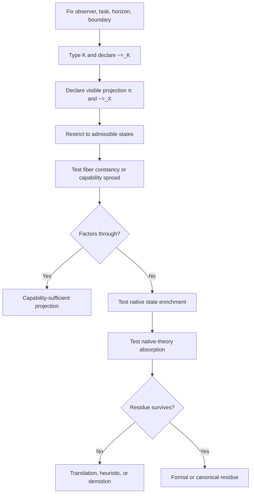

# Deep Research Review of Candidate North Star v0.5

## Executive summary

The two uploaded v0.5 drafts are substantially aligned on the core thesis: **Capability Projection** should be treated not as a discovery that “observable equivalence can fail to preserve capability,” but as a disciplined audit for when a typed, task-indexed capability object fails to factor through a chosen observer-visible projection. That is the strongest defensible reading of the project, and it is a good one. The original research request also explicitly asks for a “strongest version first, hostile audit second, demotion third” review posture, which the drafts mostly earn by already disclaiming paper-level novelty, by centering typed `Cap`, and by insisting on absorption testing before any claim of residue. fileciteturn0file0 fileciteturn0file1 fileciteturn0file2

My overall verdict is: **mostly sound with repairs, highly usable as an aspirational North Star, but only if v0.6 is framed as a North Star plus audit protocol rather than as a latent theorem program**. Across decision theory, control, semantics, abstraction, databases, and quantum resource theory, the central phenomenon is already heavily occupied by mature frameworks: sufficient statistics and Blackwell/Le Cam in statistics, information states and belief states in control, behavioral equivalence spectra in semantics, Galois-style abstractions in program analysis, query determinacy and provenance in databases, and convertibility/monotones in resource theories. That means the project’s likely best-case contribution is **translation residue** or, with luck, **formal residue** via a cross-domain transfer theorem or a canonical minimal-enrichment result. The drafts themselves increasingly acknowledge exactly that, and the external literature strongly supports that posture. fileciteturn0file0 fileciteturn0file1 citeturn26academia1turn34academia1turn27academia0turn27academia2turn36academia3turn10academia1turn11academia0turn30view0

The mathematics is the cleanest part of the current draft. The factorization definition, the fiber-constancy lemma, the minimal capability-preserving quotient, and the “trivial enrichment theorem” all make good sense in the category of sets once admissible states and equivalence relations are fixed. The main repair needed is precision about codomains: for exact quotient language, the cleanest type is often `X / ~=_X -> K / ~=_K`, or else a statement that `Cap` is tracked only up to `~=_K` as a relation on outputs. For preorder-valued, metric-valued, stochastic, or enriched capability objects, quotient language is no longer the universal default; one typically wants an induced equivalence, a reflection to a poset, or a metric/pseudometric summary instead. That is a repair, not a collapse. fileciteturn0file0 fileciteturn0file1 citeturn26academia1turn8academia2turn36academia3

The physics sections are viable **only** under the draft’s “no-free-physics” rule, and that rule is one of the best parts of v0.5. Quantum resource theory is the strongest current anchor because it already provides typed resource objects, free operations, operational monotones, catalytic phenomena, and asymptotic convertibility results. General relativity is the second-strongest anchor when restricted to causal accessibility, domains of dependence, and horizons. Thermodynamic resource theory is also strong. Detector/metrology provenance is valuable, but mainly as evidence infrastructure rather than as a grand physical witness. Topological response is promising but narrower. EFT/RG is better treated as an absorber or bridge than as a residue engine. Standard Model representation talk should be narrowed to **constraints on admissible transformations**, not to “capability” simpliciter. Dark matter and dark energy should stay demoted unless they are rewritten as typed operational audits rather than analogies. fileciteturn0file0 fileciteturn0file1 citeturn30view0turn2academia7turn18academia0turn18academia3turn17academia0turn15academia1turn19academia0turn19academia1turn23academia2turn24academia2turn25academia0

The two recorded witness verdicts also look correct. The vector/ANN case is absorbed because HNSW vs IVFFlat differs precisely in hidden, operationally legitimate index state and tuning parameters, while the ANN ecosystem already evaluates the relevant object in terms of recall/latency/memory/build tradeoffs. The QRT witness is absorbed because same local shadow with different global convertibility is already native QRT territory once the access profile and free operations are stated. Both are honest **translation residue** outcomes. The next-best witnesses are not “more counterexample pairs,” but domains where one might prove a minimal enrichment or transfer theorem: filtered ANN with optimizer/index state; GR causal accessibility under restricted observers; thermodynamic convertibility with catalytic or finite-time constraints; and a process-semantics or database theorem that identifies a canonical capability-preserving quotient family. fileciteturn0file0 citeturn4view0turn37view0turn37view1turn5view0turn3academia3turn28academia0turn30view0turn31academia0turn30view2

## Materials reviewed and synthesis of the two drafts

I reviewed the two uploaded draft documents and the original research request, then compared them against primary or near-primary literature in decision theory, control, semantics, abstraction, databases, quantum resource theories, thermodynamic resource theory, general relativity, topological phases, and current ANN systems and benchmarks. The external source set intentionally mixes foundational papers and reviews with recent 2024–2026 work where it materially sharpens the witness and systems-side analysis, especially for filtered vector search and the latest QRT generalizations. fileciteturn0file0 fileciteturn0file1 fileciteturn0file2 citeturn26academia1turn27academia0turn36academia0turn11academia0turn30view0turn2academia7turn3academia3

Both drafts share the same strongest spine: fixed indices on observer/task/horizon/boundary; an explicit projection `pi`; a typed capability map `Cap`; visible and capability equivalences; a factorization test; fiber constancy; a minimal `~_Cap` quotient; absorption testing; and a residue ladder that expects translation residue by default. The Claude draft is stronger where the project needs **operational memory**: it records two witness results, names likely failure labels, adds the no-free-physics discipline more concretely, and carries a more explicit witness-run posture. The Codex draft is tighter editorially: it is cleaner about approximate equivalence in the reviewer checklist, slightly more compact, and better organized as a reviewable spec. The best v0.6 would take the **formal spine and editorial economy from Codex**, but keep the **witness record, domain calibration texture, and physics witness posture from Claude**. fileciteturn0file0 fileciteturn0file1

| Draft feature | Claude draft | Codex draft | Recommendation for synthesis |
|---|---|---|---|
| Governing sentence and formal core | Full and strong. fileciteturn0file0 | Essentially identical. fileciteturn0file1 | Keep shared text with a small codomain repair. |
| Witness record | Explicitly records vector/ANN and QRT as translation residue. fileciteturn0file0 | Mostly absent from main body. fileciteturn0file1 | Keep Claude’s witness record in the main note or a short appendix. |
| Reviewer checklist | Strong and detailed. fileciteturn0file0 | Slightly crisper on approximate criteria. fileciteturn0file1 | Merge, but keep Codex wording where it sharpens approximation. |
| Domain calibration | More realistic and candid about absorption. fileciteturn0file0 | Compact and useful. fileciteturn0file1 | Keep compact pattern, but retain Claude’s concrete examples. |
| Physics posture | Stronger on access-profile discipline and witness triage. fileciteturn0file0 | Cleanly states “known physics → induced Cap → audit.” fileciteturn0file1 | Keep both; this is one of the most defensible parts of the project. |
| Appendix navigation | Good burden table. fileciteturn0file0 | Slightly broader and cleaner appendix map. fileciteturn0file1 | Use Codex appendix map, but keep Claude’s burden framing. |

The original research request asks not whether v0.5 is publishable as a theorem, but whether it is mathematically disciplined, prior-art aware, physics-grounded, and useful as a North Star. On that standard, the answer is yes—with the important qualification that the project’s *narrative center of gravity* should shift from “candidate theorem” toward “cross-domain audit template plus witness discipline.” That is not a retreat; it is the strongest coherent version of the work visible in both drafts and in the literatures they engage. fileciteturn0file2 fileciteturn0file0 fileciteturn0file1 citeturn26academia1turn27academia0turn36academia3turn10academia1turn30view0

## Mathematical assessment

The core definition of projection sufficiency is basically right. In plain language: the observer-visible state determines the declared capability object, up to the declared capability equivalence. That is a good and portable abstraction. The main mathematical repair is not the notion itself, but the typing. If `~=_K` is a genuine equivalence relation and the project wants literal quotient language, then the cleanest map is often `\bar C : X / ~=_X -> K / ~=_K`; alternatively, the current text can keep `\bar C : X / ~=_X -> K` if it explicitly says that equality of outputs is always interpreted only modulo `~=_K`. For preorder-valued or metric-valued capability objects, quotienting is not automatically the right move; one usually wants an induced equivalence, a reflection into a poset, or a pseudometric summary. That recommendation matches how neighboring theories handle approximate and order-sensitive comparison rather than exact sameness. fileciteturn0file0 fileciteturn0file1 citeturn26academia1turn8academia2turn36academia3

The fiber-constancy lemma is also correct with one clarifying repair: it should explicitly refer to fibers of the **equivalence-saturated visible state**, not just literal set-theoretic fibers when `~=_X` is coarser than equality. In other words, the right object is the preimage of a visible equivalence class, or equivalently constancy on admissible states with the same visible class. The proof sketch in the draft is fine for set-valued maps. Edge cases arise when `Cap` is partial, random, stochastic, or enriched: then “constant on fibers” becomes “equal almost surely,” “inducing the same risk/decision class,” or “lying within the declared tolerance ball.” Those are straightforward extensions, but they should be mentioned explicitly in v0.6 so reviewers cannot accuse the note of silently switching semantic regimes mid-stream. fileciteturn0file0 fileciteturn0file1 citeturn26academia1turn27academia0turn8academia2

The “minimal capability-preserving quotient” is a good phrase when `~_Cap` is genuinely an equivalence. The concept is mathematically standard enough to be legible, but its *names* vary by domain. In statistics it is closest to sufficiency and experiment comparison; in control and POMDPs it becomes a sufficient information state or belief state; in automata it resembles a Nerode-style distinguishability quotient; in process semantics it becomes a behavioral equivalence quotient; in abstract interpretation it becomes an abstract domain or abstraction-refinement problem; in databases it becomes determinacy/rewritability through a view image. This is a long way of saying that the concept is sound, but its novelty is *relational and translational*, not foundational. That is exactly why the project should stop hinting at hidden theoremhood and instead foreground its cross-domain audit discipline. fileciteturn0file0 fileciteturn0file1 citeturn26academia1turn27academia0turn22academia3turn36academia3turn10academia1

“Capability spread” is a genuinely useful object, even if the name is not yet canonical. It packages the *set of capability classes remaining compatible with a given visible class*, which is exactly the right thing to inspect when factorization fails. In finite settings, cardinality is meaningful. In metric spaces, diameter is meaningful. In decision settings, **maximal regret**, risk spread, or value gap may be better than raw diameter. In order-theoretic settings, width or incomparability structure may be the right finite summary. In geometric settings, Hausdorff distance between reachable or viable sets is often more natural than raw diameter. So I would keep the object, but expand the guidance: “choose a spread summary native to the structure of `K`.” That would make the concept both stronger and less arbitrary. fileciteturn0file0 fileciteturn0file1 citeturn26academia1turn8academia2turn27academia0

The “capability type gate” is directionally correct but should become stricter. A serious witness should require: a domain-native operational test for `Cap`; an admissible-state subset; a declared observer access profile; a positive preservation control; a negative non-factorization fixture; and a statement of why `Cap` is not merely a relabeling of the witness itself. The draft already gestures toward this with `under_typed`, `projection_underdescribed`, and `gerrymandered_capability`, but v0.6 should elevate those from warning labels into **hard gate conditions**. That move would align the project even more clearly with the operational discipline already found in experiment comparison, information-state control, abstract interpretation, provenance, and resource theories. fileciteturn0file0 fileciteturn0file1 citeturn26academia1turn27academia0turn36academia3turn11academia0turn30view0

That audit flow is the clearest “mathematics-to-practice” contribution in the project: it turns a vague intuition into a sequence of falsifiable checks. It is also exactly where the drafts are strongest. fileciteturn0file0 fileciteturn0file1

| Mathematical claim in v0.5 | Verdict | Evidence strength | Recommended repair |
|---|---|---|---|
| Projection sufficiency as factorization up to declared equivalence | Keep | High | Clarify codomain as `K / ~=_K` or state explicitly that outputs are compared only modulo `~=_K`. fileciteturn0file0 fileciteturn0file1 |
| Fiber-constancy lemma | Keep | High | Say “fiber of visible equivalence class” and note partial / stochastic / approximate variants. fileciteturn0file0 citeturn8academia2turn27academia0 |
| Minimal capability-preserving quotient | Keep | Medium-high | Add domain-specific aliases: sufficient statistic, information state, Nerode quotient, behavioral quotient, abstract domain, determinacy image. citeturn26academia1turn27academia0turn22academia3turn36academia3turn10academia1 |
| Capability spread | Keep, but sharpen | Medium | Offer native summaries: regret spread, Hausdorff distance, order width, value gap. citeturn26academia1turn27academia0 |
| Trivial enrichment theorem | Keep | High | Keep as an anti-overclaiming guardrail, but immediately emphasize minimal/canonical/operational enrichment. fileciteturn0file0 |
| Capability type gate | Keep and harden | Medium-high | Require operational test, controls, observer profile, admissible-state subset, anti-gerrymandering argument. citeturn27academia0turn11academia0turn30view0 |

## Prior-art absorption and likely residue

The strongest absorption comes from **statistical decision theory**. Blackwell’s comparison of experiments and Le Cam’s experiment comparison apparatus already formalize what it means for one information structure to dominate another relative to decision tasks, and they do so in precisely the spirit of “future capability determined by visible data for a task family.” Moreover, modern work on Blackwell order continues to study how coarse-graining, garbling, and information loss interact with decision value. So if v0.5 were presented as a novelty claim about decision-relevant sufficiency, it would be absorbed almost immediately. What survives is broader scope: the draft wants a typed audit language that can also talk about provenance objects, reachable sets, database rewrite classes, convertibility preorders, and observer-indexed physics access structures. That broader *schema* may still be useful, but it must not claim to have discovered the underlying decision-theoretic phenomenon. citeturn26academia1turn34academia1turn26academia2

**Control and dynamical systems** absorb a large second chunk. In centralized partial observation, belief states are the classic sufficient information state; in decentralized settings, common-information and information-state reductions explicitly show how extra state restores a Markov or POMDP representation. In other words, state-enrichment absorption is already a first-class citizen in this literature. If an output map fails to preserve control-relevant capability, the standard move is not metaphysics but reconstruction or state augmentation. This does not kill the North Star; it tells you where it is most honest: as a cross-domain label for a pattern that control theorists already know extremely well. citeturn27academia0turn27academia2

**Semantics and abstraction** are an even stronger absorber for the computational side. Process semantics already offers whole spectra of observational and testing equivalences, along with distinguishing formulae. Abstract interpretation makes loss through abstraction the whole point, and studies precisely when an abstraction remains sound for the property of interest. Bisimulation metrics add approximate rather than exact behavioral preservation. This is about as close as one can get to “projection sufficiency for typed capabilities” without using the same words. The useful residue here is therefore not theorem novelty but **interoperability**: v0.5 can become a broker language that lets database people, control people, and physics people talk about roughly the same audit pattern without pretending they are all doing the same mathematics internally. citeturn22academia3turn8academia2turn36academia3turn36academia0

**Databases and information systems** absorb much of the operational data story. Query determinacy already asks whether a desired query answer is determined by a view image; provenance work records the hidden support and derivational structure behind visible answers; vector-search systems explicitly treat index family, encoding, search parameters, and post-verification behavior as operational state that shapes recall/latency/memory tradeoffs. The v0.5 ANN witness is therefore correctly labeled as `projection_underdescribed`: the system’s effective state is not just “the corpus,” and the industrial and benchmarking ecosystem already treats that additional state as native rather than illicit. This is one of the clearest places where the project’s absorption protocol genuinely works. citeturn10academia1turn11academia0turn4view0turn37view0turn37view1turn5view0turn3academia3

The **sheaf / geometry / category** neighborhood is more subtle. Abramsky–Brandenburger style sheaf language is excellent for local-to-global obstruction and for “does compatible local data glue to a global section?” questions. That makes it intellectually very attractive for a project about observer-local shadows and hidden capability differences. But it is not yet the right core frame for v0.5. At present, it is better treated as optional packaging for future witnesses that genuinely exhibit a local-to-global obstruction, rather than as required front-matter. Otherwise the project risks looking more exotic than it is. citeturn8academia4turn8academia3

The existing two-category absorption protocol—**state-enrichment absorption** and **native-theory absorption**—is good, but v0.6 should add two more named modes. One is **representation-choice absorption**, for cases where the apparent witness disappears once gauge, coordinate, labeling, or interface conventions are fixed correctly. The other is **criterion-choice absorption**, for cases where a dramatic failure depends on choosing an unnatural comparison metric on `K`. Those additions would catch a lot of future false positives, especially in physics and approximate systems. “Translation residue” is a legitimate and important outcome, and the draft is correct that it should usually be the default expectation. fileciteturn0file0 fileciteturn0file1

| Neighbor field | What it already covers | Residue left for Capability Projection |
|---|---|---|
| Statistical experiments and decision theory | Sufficiency, informativeness, garbling, deficiency, decision-value comparison across experiments. citeturn26academia1turn34academia1turn26academia2 | Mostly translation residue, unless the project proves a transfer theorem beyond probabilistic decision tasks. |
| Control, POMDPs, decentralized control | Belief states, information states, common-information reductions, state augmentation. citeturn27academia0turn27academia2 | Translation residue; maybe formal residue if a cross-domain minimal-enrichment theorem is shown. |
| Process semantics and abstraction | Observational/test equivalence ladders, distinguishing logics, approximate behavioral metrics, abstract domains. citeturn22academia3turn8academia2turn36academia3 | Translation residue, possibly formal residue if “capability spread” gets a reusable theorem across semantics families. |
| Databases and provenance | Query/view determinacy, rewritability, provenance, hidden operational state. citeturn10academia1turn11academia0 | Translation residue; maybe formal residue if a minimal enrichment family for ANN/database workloads is identified. |
| Sheaf/category/local-to-global | Gluing failures, obstruction to global sections, local-vs-global semantics. citeturn8academia4turn8academia3 | Optional formal language, not present residue yet. |
| Quantum resource theories | Free states, free operations, convertibility, monotones, catalysis, asymptotic laws. citeturn30view0turn2academia7 | Translation residue now; formal residue only if the project proves a cross-domain bridge theorem. |

## Physics grounding and witness review

The **no-free-physics rule** should stay, and it should become even more prominent. “Known physics → induced `Cap` → projection-sufficiency audit” is exactly the right direction of explanation. It blocks the two biggest failure modes in ambitious theory notes: rebranding familiar physics as evidence for a favored abstraction, and treating metaphor as ontology. External literature strongly supports this discipline because the strongest candidate anchors—resource theories, causal structure, and thermodynamic convertibility—already have native operational content. fileciteturn0file0 fileciteturn0file1 citeturn30view0turn18academia0turn15academia1

**Quantum resource theory** is the best current physics-facing anchor. The reason is structural, not rhetorical: QRT already partitions states into free and resourceful ones, defines free operations, studies convertibility, proves monotonicity results, and analyzes catalytic and asymptotic regimes. The draft’s local-vs-global caveat is also exactly right. The same reduced local state need not determine global entanglement or convertibility; LOCC transformability depends on the global state and the allowed operations, not merely on a local marginal. Nielsen’s majorization criterion, multipartite incomparability results, and recent work re-establishing generalized resource-theoretic second-law structure all reinforce that QRT already owns this terrain once the access profile is fixed. That is why the current QRT witness is honestly **translation residue**: the draft is importing a good audit vocabulary into an already mature operational theory. citeturn30view0turn31academia0turn30view1turn30view2turn2academia7

**General relativity causal accessibility** is the second-strongest anchor and should be promoted in v0.6. Global hyperbolicity, domains of dependence, causal diamonds, event horizons, and related structures are already observer-indexed restrictions on what can be influenced, reconstructed, or even known. That makes GR unusually well-matched to a typed capability language if `Cap` is explicitly taken to be an accessibility or reconstruction object rather than a vague “power.” The strongest version here is modest: use causal accessibility as a domain where observer-visible regions and operational reachability genuinely differ, while letting the native absorber remain causal structure itself. The stress-test power of black holes then becomes a special case, not the headline. citeturn18academia0turn18academia1turn18academia3turn17academia0

**Thermodynamic resource theory** is also strong enough to keep. Recent and classic work in quantum thermodynamics and stochastic thermodynamics both support operationally typed capability notions: work extraction, free-energy monotones, entropy production, finite-time constraints, and state convertibility under thermal operations. This domain also helps with the draft’s treatment of time: it supports the claim that arrows and monotones do not magically arise from arbitrary closed reversible dynamics, but instead depend on coarse-graining, baths, nonequilibrium conditions, work accounting, or operational restrictions. That is exactly the right obstruction logic for the project’s “time is not replacement time” caution. citeturn15academia1turn19academia0turn19academia1turn19academia3

**Detector and instrumentation provenance** should stay, but be framed as evidence infrastructure rather than as high theory. Scientific provenance systems, calibration workflows, and detector-performance pipelines show that hidden operational state, logging, and traceability frequently determine what claims a visible data product can support. That is very much in the spirit of a typed capability audit. But it is best presented as a practical bridge between abstract audit language and research workflow integrity. It strengthens the repo’s methodology, even if it does not furnish deep residue on its own. citeturn38academia1turn38academia5turn38academia7

**Condensed matter and topological response** are promising but narrower. Topological insulators, superconductors, and non-Abelian anyon systems offer unusually crisp cases where local perturbations do not destroy certain global or boundary capabilities, and where the relevant “capability” can be typed as a protected edge mode, a topological response invariant, or an admissible braiding/operation class. This domain is potentially strong because the protection is operational and symmetry-structured. The risk is overgeneralizing from a specialized regime. So this belongs in the witness bank, but not yet as the main philosophical banner. citeturn23academia2turn23academia0turn23academia3

**EFT/RG and coarse-graining** are better understood as an absorber or bridge than as a residue engine. Renormalization and effective field theory already formalize how microscopic information can be discarded while preserving low-energy predictive capability, and they do so with far more technical depth than the current North Star needs. This is therefore an excellent calibration domain and a likely source of preservation controls, but probably not where canonical residue will first be found. citeturn15academia2turn15academia0

**Standard Model structure** should be narrowed. It is defensible to say that gauge representations, charges, chirality, and selection rules constrain admissible transformations. It is **not** yet defensible to say that those are themselves the project’s `Cap` in some broad sense. The right phrasing is that representation structure may constrain a capability object defined elsewhere; it is a typed constraint surface, not automatically the capability object itself. That narrowing keeps the physics real and avoids turning symmetry bookkeeping into metaphysical surplus. citeturn25academia0turn24academia2

**Black holes** belong in the note as observer-indexed access stress tests, not as evidence for hidden universal “capability” structure. Horizon literature already distinguishes global event horizons from more quasilocal boundaries and shows just how observer- and definition-sensitive these structures are. That makes the area useful for testing access-profile discipline, but not for hand-wavy narrative escalation. citeturn17academia0turn18academia0

**Emergence** can remain as a nearby motivating lens, but it should be demoted from core evidence. Modern causal-emergence work does argue that macroscales can improve causal efficacy under certain measures, and active-inference work does give a principled language for action under uncertainty. But these are adjacent frameworks, not obvious absorbers or direct support for the present formal core. Keep them as neighboring motivation, not as proof that Capability Projection has uncovered a new scientific law. Dark matter and dark energy should stay demoted unless recast as typed operational audits with explicit observer/task/resource structure. citeturn32academia0turn32academia1turn20academia2turn20academia4

| Physics-facing domain | Keep or demote | Best typed `Cap` candidate | Native absorber | Honest default residue |
|---|---|---|---|---|
| Quantum resource theory | Keep strongly | Convertibility preorder, distillation/formation rates, monotone family | QRT itself. citeturn30view0turn2academia7 | Translation residue |
| GR causal accessibility | Keep strongly | Accessibility / reconstructibility structure from causal regions | Causal structure and horizon theory. citeturn18academia0turn17academia0 | Translation or formal residue |
| Thermodynamic resource theory | Keep strongly | Work/free-energy/convertibility envelope | Thermal operations and entropy-production theory. citeturn15academia1turn19academia0turn19academia1 | Translation or formal residue |
| Detector/provenance/metrology | Keep, but as infrastructure | Traceable reconstruction and admissibility rights | Calibration/provenance standards and workflows. citeturn38academia1turn38academia5 | Heuristic or translation residue |
| Topological response | Keep narrowly | Protected boundary/response operation class | Topological band and anyon theory. citeturn23academia2turn23academia0 | Formal residue candidate |
| EFT/RG | Keep as bridge | Low-energy predictive capability class | RG/EFT itself. citeturn15academia2turn15academia0 | Strong absorption |
| Standard Model structure | Narrow | Constraint set on admissible transformations | Gauge/representation theory. citeturn25academia0turn24academia2 | Heuristic only unless typed better |
| Black holes | Keep as stress test | Observer-indexed access / reconstruction class | Horizon theory. citeturn17academia0 | Translation residue |
| Dark matter / dark energy | Demote | None yet, unless fully typed | Current cosmology, not this framework | Analogy only |

The two existing witness runs are well judged. For the **vector/ANN witness**, the translation-residue verdict is correct because Faiss and ANN-Benchmarks already make index family, search parameters, and tradeoff surfaces part of the native operational object, and recent filtered-vector-search work makes the point even sharper: engine strategy and query selectivity can override simple algorithm-brand intuitions, with IVFFlat outperforming HNSW in some low-selectivity regimes. This means the witness is useful as an anti-cheating success for the audit, but not as evidence of new residue. A stronger database/ANN witness would have to prove something like a **minimal enrichment family** over workload and selectivity, not just show that hidden implementation state matters. fileciteturn0file0 citeturn4view0turn37view0turn37view1turn5view0turn3academia3turn28academia0

For the **QRT witness**, the translation-residue verdict is also correct. The strict-local-observer caveat is handled properly in the draft: a local marginal can underdetermine global convertibility, but that is already a native fact of entanglement and resource theory once the allowed operations are made explicit. A stronger quantum witness would therefore need to do more than show “same local shadow, different global resource.” It would need either a cross-domain theorem connecting the draft’s audit objects to canonical QRT structures, or a resource-theoretic minimality result that generalizes beyond today’s examples. Without that, QRT remains the best physics anchor and the strongest current absorber. fileciteturn0file0 citeturn30view0turn31academia0turn30view2turn2academia7

## Revision package for v0.6

The right strategy is **North Star plus audit protocol**, not “audit framework instead of North Star.” The North Star language matters because it gives the repo a motivating sentence and a research taste. But the audit protocol is what makes the draft reviewable, falsifiable, and resistant to self-deception. So my recommendation is: keep the aspirational framing, shorten the main note, move more domain detail into appendices, and let the main document read like a compact formal charter with explicit collapse conditions. That preserves boldness without overclaiming. fileciteturn0file2 fileciteturn0file0 fileciteturn0file1

The red flags are fairly concentrated. Avoid saying or implying that the project has discovered a new foundational phenomenon in mathematics, control, or quantum theory; avoid talking as if “future capability” were itself a single canonical scalar; avoid using physics examples as support unless `Cap`, allowed operations, and access profile are typed from established theory; avoid treating hidden operational state in databases, control, or ANN systems as if neighboring literatures had somehow missed it; and avoid letting `Cap` drift from operational object to rhetorical placeholder. Those are the phrases most likely to trigger a hostile review. citeturn26academia1turn27academia0turn11academia0turn30view0

The safe strong wording is also clear. It is defensible to say that the project studies **projection sufficiency for typed capability objects**; that its purpose is to test whether a chosen visible state is sufficient for a chosen capability object under declared equivalence; that non-factorization is old but a reusable audit discipline may still be useful; that honest absorption by mature theories is a success condition for the audit instrument, not a failure; and that the strongest hoped-for outcome is a cross-domain transfer theorem or a canonical minimal-enrichment family, not a vague accumulation of examples. fileciteturn0file0 fileciteturn0file1

A good v0.6 outline would have a short main note with five compact blocks: governing statement; formal core; anti-gerrymandering/type gate; absorption protocol and residue ladder; and collapse condition. Then move the rest into appendices or companion reports: mathematical variants, prior-art map, physics grounding, and witness bank. This would materially improve reviewability and also make the project easier to update as new witnesses are run. fileciteturn0file0 fileciteturn0file1

### Proposed v0.6 core text

> **Capability Projection** studies projection sufficiency for typed capability objects.  
> For fixed observer, task family, horizon, admissible state set, and resource boundary, a visible projection is sufficient exactly when the declared capability object is determined by visible-state class, equivalently when capability is constant over visible equivalence fibers.
>
> The phenomenon that coarse observations can erase decision-, control-, provenance-, or resource-relevant distinctions is not new. The purpose of this note is not to claim novelty for non-factorization. Its purpose is to provide a disciplined audit: type `Cap`; declare `~=_X` and `~=_K`; test fiber constancy; identify capability spread; test native enrichments and native absorber theories; and record the residue honestly.
>
> Every proposed witness must survive anti-gerrymandering checks. `Cap` must be domain-native, operationally legible, fixed before witness construction, and accompanied by positive preservation controls and negative non-factorization fixtures. If a mature neighboring theory restores factorization by legitimate state enrichment, or already provides the relevant equivalence and convertibility theorem, the correct verdict is absorption, not promotion.
>
> Physics enters only through typed capability objects induced by known physics under explicit access profiles and allowed operations. It does not license reverse inference from the audit language back into physics.
>
> The expected default outcome is translation residue or heuristic residue. Stronger outcomes require either a canonical capability-preserving quotient, a minimal natural enrichment family, or a transfer theorem that is nontrivial across at least two mature fields. fileciteturn0file0 fileciteturn0file1

### Selected citation plan with insertion points

| Reference | What it supports | Suggested insertion point | Priority |
|---|---|---|---|
| Chitambar & Gour, *Quantum Resource Theories* (2019). citeturn30view0 | General QRT framework: free states, free operations, convertibility, monotones | First paragraph of physics posture; QRT witness section | Essential |
| Nielsen, *Conditions for a Class of Entanglement Transformations* (1998). citeturn31academia0 | LOCC convertibility as majorization; local-vs-global resource point | QRT witness details | Essential |
| Bennett et al., *Exact and Asymptotic Measures of Multipartite Pure State Entanglement* (1999/2000). citeturn30view1 | Multipartite incomparability and irreversibility | QRT and physics grounding | Useful |
| Hayashi & Yamasaki, *Generalized Quantum Stein’s Lemma and Second Law of Quantum Resource Theories* (2024). citeturn2academia7 | Modern QRT asymptotic law; path to formal residue | QRT “next checks” paragraph | Useful |
| Mariucci, *Le Cam theory on the comparison of statistical models* (2016). citeturn26academia1 | Experiment comparison, deficiency, approximate sufficiency | Prior-art section; codomain/equivalence caveat | Essential |
| Rauh et al., *Coarse-graining and the Blackwell order* (2017). citeturn34academia1 | Blackwell order and coarse-graining tension | Statistical-neighbor absorption | Useful |
| Mahajan & Mannan, *Decentralized stochastic control* (2013). citeturn27academia0 | Information-state framing in control | Control absorption | Essential |
| Nayyar, Mahajan & Teneketzis, *Common Information Approach* (2012). citeturn27academia2 | State enrichment and centralized reduction in decentralized control | Control absorption | Essential |
| Cousot, *Calculational Design... by Abstract Interpretation* (2023). citeturn36academia0 | Modern abstract-interpretation-as-semantic-abstraction framing | CS/abstraction absorption | Useful |
| Darais & Van Horn, *Constructive Galois Connections* (2015). citeturn36academia3 | Abstraction/concretization formalisms | Mathematical review and abstraction neighbor | Useful |
| Bisping et al., *Linear-Time–Branching-Time Spectroscopy* (2021). citeturn22academia3 | Known spectra of behavioral equivalence and distinguishing tests | Process semantics section | Useful |
| Benedikt et al., *Monotonic determinacy and rewritability* (2020). citeturn10academia1 | View/query determinacy as database absorber | Database section | Essential |
| Grädel & Tannen, *Provenance Analysis and Semiring Semantics for FOL* (2024). citeturn11academia0 | Provenance as native hidden-support structure | Database/provenance section | Essential |
| Faiss documentation and index wiki. citeturn4view0turn37view0turn37view1 | Operational differences among HNSW, IVFFlat, and vector indexing choices | ANN witness section | Essential |
| ANN-Benchmarks official site. citeturn5view0 | Recall/QPS benchmark object for ANN systems | ANN witness section | Essential |
| Amanbayev et al., *Filtered ANN Search in Vector Databases* (2026). citeturn3academia3 | Stronger modern ANN witness candidate; optimizer/index-selectivity interactions | ANN next-witness paragraph | Useful |
| Minguzzi & Sánchez, *The causal hierarchy of spacetimes* (2006). citeturn18academia0 | GR causal ladder and accessibility structure | GR anchor section | Essential |
| Bernal & Sánchez, *On smooth Cauchy hypersurfaces and Geroch’s splitting theorem* (2003). citeturn18academia3 | Domains of dependence / global hyperbolicity structure | GR anchor section | Essential |
| Booth, *Black hole boundaries* (2005). citeturn17academia0 | Horizon and observer-sensitive boundary notions | Black-hole posture | Useful |
| Lostaglio, *Resource theory approach to thermodynamics* (2018). citeturn15academia1 | Typed thermodynamic resource objects | Thermodynamic section | Essential |
| Brandão et al., *The second laws of quantum thermodynamics* (2013). citeturn19academia0 | Many-second-laws perspective | Thermodynamic section | Useful |
| Seifert, *Stochastic thermodynamics* (2012). citeturn19academia1 | Entropy production and open/nonequilibrium arrow discipline | Time/thermodynamic caution | Essential |
| Qi & Zhang, *Topological insulators and superconductors* (2010). citeturn23academia2 | Protected boundary modes / topological response | Condensed-matter witness section | Useful |
| Abramsky & Brandenburger, *Sheaf-Theoretic Structure of Non-Locality and Contextuality* (2011). citeturn8academia4 | Local-to-global obstruction language | Optional math appendix | Optional |
| Hoel, *Causal Emergence 2.0* (2025) and related work. citeturn32academia0turn32academia1 | Emergence as nearby literature, not core support | Emergence appendix only | Optional |

### Concrete next research actions

| Next action | Why this is the right next test | Best possible outcome |
|---|---|---|
| Run a **filtered ANN/database witness** with fixed embeddings but varying index, optimizer, and metadata-selectivity regime | This is the strongest near-term systems witness because current literature already shows workload and query-selectivity structure change the effective capability object. citeturn3academia3turn5view0 | Formal residue if you prove a minimal enrichment family over workload/selectivity |
| Build a **GR causal-accessibility witness** around domains of dependence and observer-restricted regions | GR offers a naturally typed accessibility `Cap` and clear access profiles. citeturn18academia0turn18academia3 | Formal residue if the audit yields a reusable cross-domain accessibility pattern |
| Run a **thermodynamic resource witness** with finite-time or catalytic constraints | Thermodynamics has native convertibility objects and modern nontrivial monotone structure. citeturn15academia1turn19academia0turn19academia1 | Formal residue if capability spread maps cleanly onto operational thermodynamic gaps |
| Attempt a **process-semantics comparison** using testing equivalence or bisimulation metrics | This tests whether capability spread or minimal quotient language transfers beyond sets into behavioral semantics. citeturn22academia3turn8academia2 | Cross-domain transfer theorem |
| Attempt a **capability-preserving quotient theorem** in one well-scoped domain | The project most needs one nontrivial minimality result, not more examples | Formal residue, maybe canonical residue if the quotient is native and unique enough |
| Rewrite the **main note + appendices** into a short spec plus evidence bank | This immediately improves rigor and survivability under hostile review | Stronger v0.6 without changing the research agenda |

The most honest default expectation remains what the best parts of v0.5 already say: **translation residue or heuristic residue by default; formal residue only if a real theorem or minimality result survives absorption; canonical residue as an aspirational long shot**. That is not a small ambition. It is the appropriately disciplined one. fileciteturn0file0 fileciteturn0file1