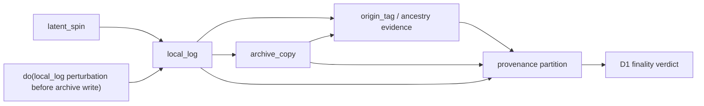
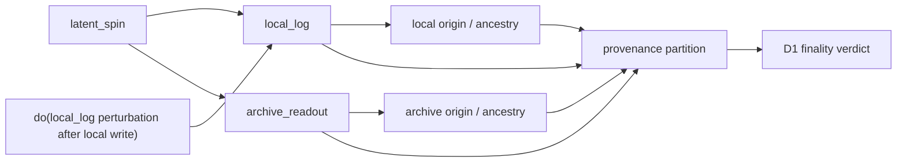
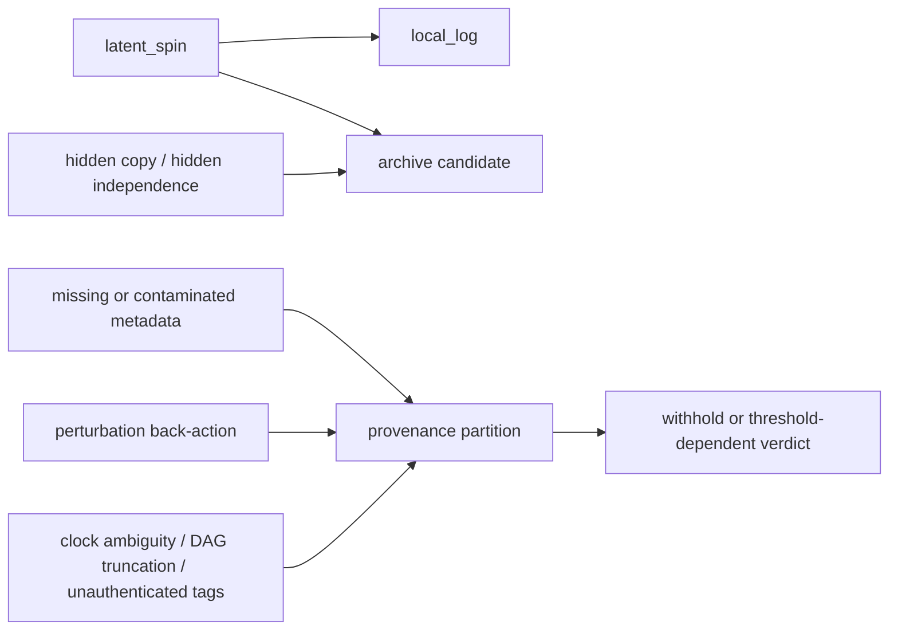
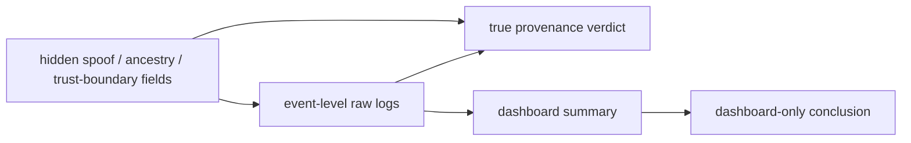

# P19 - Causal Inference Expert Run

- persona: Causal Inference Expert
- goal_id: P19
- run_timestamp: 2026-06-21T03:52:35-05:00
- queue_source: `explorations/persona-future-run-goals-2026-06-20.md`
- goal: Draw causal DAGs for detector provenance controls and state which
  interventions identify independence, copied dependence, provenance failure, or
  post hoc dashboard artifacts.
- posture: bounded exploratory run only; no claim-status update, roadmap
  change, or ledger edit.

## Repo Context Read

- `tests/T66-povm-detector-calibration-obstruction.md`
- `tests/T67-povm-correlation-provenance-obstruction.md`
- `tests/T68-intervention-sensitive-detector-provenance.md`
- `tests/T70-detector-provenance-robustness.md`
- `tests/T75-real-detector-stack-provenance.md`
- `tests/T79-dashboard-summary-nonidentifiability.md`
- `tests/T87-real-run-raw-log-contract.md`
- `models/intervention_sensitive_detector_provenance.py`
- `results/intervention-sensitive-detector-provenance-v0.1-results.md`
- `results/dashboard-summary-nonidentifiability-v0.1-results.md`
- `results/real-run-raw-log-contract-v0.1-results.md`

## Bounded Run

Question: what causal structure is actually needed before the detector branch
can say "independent readout," "copied dependence," "provenance failure," or
"dashboard artifact" without smuggling the answer in after D1 scoring?

Method:

1. Treat the detector branch as a finite provenance-augmented SCM over record
   formation and readout.
2. Keep T67's obstruction fixed: passive agreement and phi are identical across
   hostile copied and independent witnesses.
3. Use T68/T70/T79/T87 to separate four causal regimes.
4. State identification in intervention language, not in summary-statistic
   language.

## Causal DAGs

### 1. Copied dependence



Interpretation:

- The archive is a downstream child of `local_log`.
- A pre-write perturbation on `local_log` can causally propagate into the
  archive.
- Duplicate origin tags, delayed creation plus ancestry, or signed ancestry
  with `local_log` as parent are all children of the copied path and are
  therefore valid evidence for same-class partitioning before D1.

### 2. Independent readout



Interpretation:

- `local_log` and `archive_readout` share only the allowed common source
  `latent_spin`.
- Perturbing `local_log` after its own write does not change the archive.
- Distinct authenticated origin tags and ancestry with no shared parent beyond
  `latent_spin` identify different independence classes.

### 3. Provenance failure / abstain regime



Interpretation:

- T70's failure modes do not positively identify either copied dependence or
  independence.
- They identify a different causal state: the available evidence channels are
  too contaminated to fix the partition before D1.
- In causal terms, the partition node becomes underidentified because every
  authenticated path from the latent provenance relation to observed evidence is
  broken, ambiguous, or intervention-distorted.

### 4. Post hoc dashboard artifact



Interpretation:

- T79 shows that the dashboard is a coarsening map of the raw logs.
- Hidden raw-log fields can change the true provenance verdict while leaving the
  dashboard projection fixed.
- A dashboard-only conclusion is therefore a post hoc artifact of projection,
  not an identified causal determination.

## Identification Table

| target regime | identifiable from passive agreement / phi alone? | identifying intervention or evidence channel | repo verdict |
| --- | --- | --- | --- |
| copied dependence | no | `do(local_log := perturbed before archive write)` changes archive; or authenticated delayed-copy ancestry / duplicate write-once origin tag | identified in T68 |
| independent readout | no | `do(local_log := perturbed after local write)` leaves archive unchanged, plus distinct authenticated origin/ancestry with only `latent_spin` shared | identified in T68 |
| provenance failure | no | challenge interventions show no authenticated channel survives: truncated DAG, unauthenticated tags, hidden latency, perturbation back-action, or threshold-only ancestry score | identified as **withhold**, not classify, in T70 |
| dashboard artifact | no | vary hidden raw-log provenance fields while holding dashboard projection fixed; opposite raw completions remain compatible with same dashboard | identified in T79 |

## Main Finding

The detector branch only becomes causally legible after adding **provenance-side
interventions or authenticated evidence channels**. The passive detector
statistics are intentionally non-identifying.

This is the clean causal reading of the T66 -> T79 line:

1. `T66`: calibrated detector outcomes do not identify threshold or provenance
   partition.
2. `T67`: passive agreement and phi do not identify copied versus independent
   provenance class.
3. `T68`: copied dependence and independence become identifiable only after
   pre-registered intervention/provenance channels are added.
4. `T70`: when those channels are degraded, the honest causal output is
   abstention, not heroic classification.
5. `T79`: coarse dashboards are a non-identifying projection of the raw-log
   causal state.
6. `T87`: the detector branch therefore needs an event-level raw-log contract
   before any future real deployment can count as evidence.

## Smallest Honest Formal Object

The smallest useful object is not "detector outcomes plus a threshold."

It is:

```text
provenance-augmented SCM
+ pre-registered intervention set
+ authenticated raw-log evidence channels
+ explicit coarsening map to dashboard summaries
```

That object is strong enough to say:

- when copied dependence is identified;
- when independent readout is identified;
- when provenance is underidentified and D1 must be withheld; and
- when a dashboard summary is only a projection artifact.

Without that extra structure, the detector branch collapses back to passive
similarity bookkeeping.

## Proposed Next Action

If this lane is developed further, the next bounded move should be a single
formal detector-provenance SCM note that names:

1. latent provenance state;
2. admissible interventions;
3. authenticated versus unauthenticated observables;
4. the abstention region; and
5. the dashboard coarsening map.

That would convert the current detector branch from a sequence of case studies
into one explicit identification protocol.

## Claim-Status Posture

- No claim-status changes proposed.
- No roadmap or ledger changes proposed.
- Status of this run: exploratory causal-identification audit.
- Best current classification: detector Q1 survives only as a provenance-aware,
  intervention-gated admissibility discipline over event-level records, not as
  an outcome-only detector prediction.
